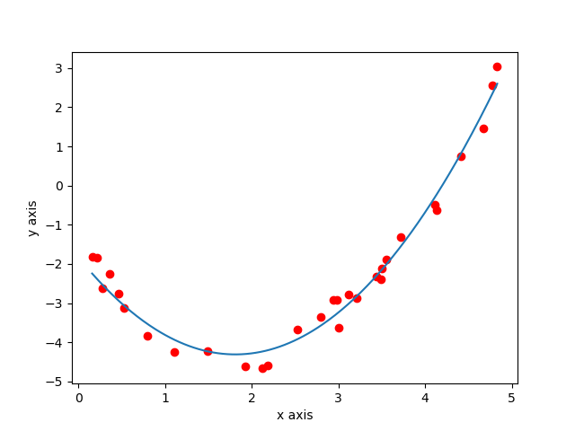

## 运用梯度下降法解决线性/非线性回归问题
用来解决一些运筹学相关的问题。仅当练习，不追求多么高的效率，可能存在些许问题。

### regression.py
文件regression.py提供了problem类，其实例对象提供了plotSets、solve、show、plot等方法。需要安装numpy和matplotlib

具体用法为：

```python
from regression import problem

p = problem(输入矩阵, 输出向量, 目标函数, 迭代次数, 特征值个数) #创建问题对象

p.plotSets() #绘制散点图 (只能绘制二维和三维图像，即自变量个数不多余两个)

p.solve() #求解

p.show() #展示求解结果

p.plot() #绘制函数图像(同样只能绘制二维和三维图像)
```

### reg_test.py

reg_test1.py ~ reg_test6.py 是几个例子，分别演示了线性、指数、二次、二元、sigmoid、二元二次等回归。

下面为reg_test3.py的代码
```python
from regression import problem

# 目标函数，th为特征值集合，x为自变量集合
def h(th, x):
    return th[2] * (x[0] ** 2) + th[1] * x[0] + th[0]

# 输入矩阵，input[i][j]表示第i+1个训练集的第j+1个自变量
input = [[2.1265350944678714], [3.714701401517071], [4.832443058664263], [1.9249251436241694], [1.488212147592674], [4.108963791619679], [4.409840662003232], [0.27611426948751017], [3.0057881913107525], [3.2129034716729987], [4.130659156489343], [2.180436694455559], [2.98031960367078], [3.113293821771909], [2.7923004706709875], [1.1072922364010078], [3.504240172209493], [2.944017471527794], [3.557193036918786], [3.435440440742223], [0.7959256926944053], [0.15762823055864683], [4.671110373561072], [4.7809916709163724], [2.526188150811943], [0.45860265126146993], [0.5293920400528707], [0.3574070373642846], [0.21551542639051624], [3.490423289409267]]

# 输出向量
output = [-4.669851786354382, -1.3193281614097883, 3.0340503602738425, -4.6186422383659025, -4.21678339644861, -0.4900664962616774, 0.7522257045781434, -2.6123772413678883, -3.629641187941539, -2.877118578599311, -0.6159000377815106, -4.591004933900116, -2.915491636046114, -2.7827507371458093, -3.3502332712879888, -4.240727453237885, -2.118531950237099, -2.9070181123176755, -1.8890957570041707, -2.323468132986038, -3.834495655527171, -1.8148885505351129, 1.4701534834750594, 2.5577055036862615, -3.679124201915033, -2.759629592057559, -3.1284576407651605, -2.2541022666869353, -1.8500099212327938, -2.3835532013865874]

# problem(输入矩阵, 输出向量, 目标函数, 迭代次数, 特征值个数)
p = problem(input, output, h, 1000, 3)

# p.plotSets()
p.solve()
p.show()
p.plot()
```
下面是运行结果：
```
耗时：0:00:00.140362
拟合结果为：h(x) = 0.756 * (x0 ** 2) + (-2.73) * x0 + (-1.83)
Theta：[-1.83153439 -2.73854395  0.75655122]
最终学习率为：0.012345679012345678
代价值为：0.04475496153086368
```

